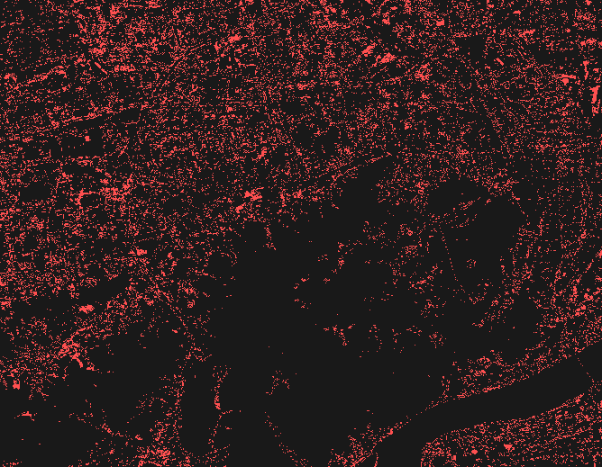
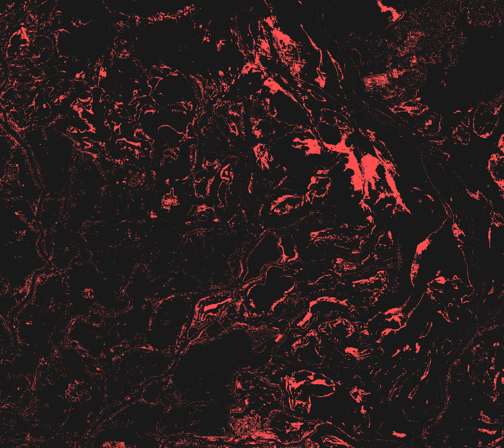

# 基于遥感影像的湿地变化检测模型研究

本仓库作为硕士毕业论文的主代码仓库，集中管理数据处理脚本、模型训练代码、实验配置与研究文档。当前版本已纳入数据预处理流程、baseline 训练代码以及主模型筛选所需的文献与实验说明。

## 研究问题

本课题围绕湿地变化检测中的以下问题展开：

- 高分辨率双时相遥感影像下的计算效率问题
- 水位波动与季节变化引起的伪变化干扰
- 复杂边界与破碎斑块区域的变化表征能力
- 跨区域场景下的模型泛化能力

当前纳入比较范围的技术路线包括：

- `Mamba / SSM`
- `Transformer / ViT`
- `Mask-based decoding`
- `Vision-Language modeling`
- `Foundation model adaptation`

## 代码结构

- [scripts/data_preparation](./scripts/data_preparation)
  - 数据下载、年度标签裁剪、变化标签构建与样本切片脚本
- [src/wetland_cd/training](./src/wetland_cd/training)
  - 当前训练代码，包括数据集读取、baseline 模型与训练入口
- [configs](./configs)
  - 数据集配置、提示词配置与实验相关参数文件
- [experiments](./experiments)
  - 本地与服务器端训练脚本
- [docs](./docs)
  - 文献调研、数据集说明、论文框架与阶段进展
- [data](./data)
  - 本地数据目录约定
- [results](./results)
  - 实验输出目录约定

## 文档内容

- [docs/literature_review/README.md](./docs/literature_review/README.md)
  - 相关模型调研与分类整理
- [docs/literature_review/open_source_shortlist.md](./docs/literature_review/open_source_shortlist.md)
  - 公开代码可复现模型清单
- [docs/dataset/README.md](./docs/dataset/README.md)
  - 数据来源、标签构建与样本统计
- [docs/thesis_framework/README.md](./docs/thesis_framework/README.md)
  - 论文结构与技术路线
- [docs/progress/README.md](./docs/progress/README.md)
  - 阶段进展与实验情况
- [docs/ROADMAP.md](./docs/ROADMAP.md)
  - 研发路线与阶段任务

## 当前进展

截至当前阶段，已完成以下工作：

1. 基于 `GLC_FCS30D` 与 `Sentinel-2` 构建湿地变化检测数据集
2. 完成 6 个典型湿地区域的双时相样本整理与标签生成
3. 完成训练样本切片及 `train / val / test` 划分
4. 跑通 `Siamese UNet` baseline，建立训练、验证与测试流程
5. 完成相关模型调研，并形成开源可复现候选清单

当前工作内容已由数据准备转入候选主模型复现与比较实验。

## 候选模型

现阶段重点关注的开源模型包括：

- `ChangeMamba`
- `ChangeViT`
- `MaskCD`
- `ChangeCLIP`
- `BAN`

上述模型分别对应状态空间建模、Transformer 主干、对象级解码、语义引导和基础模型适配等技术方向。

## 数据与版本管理说明

由于原始遥感影像、切片样本与训练权重体量较大，当前仓库不直接托管以下内容：

- 原始影像与年度全量标签
- 大规模 patch 样本
- 训练中间结果与模型权重

仓库当前纳入的是：

- 核心数据处理脚本
- baseline 训练代码
- 实验配置文件
- 研究文档与示意图

后续主模型代码与实验脚本将在本仓库中持续补充和维护。

## 研究区域示意

杭州西溪湿地变化示意：

鄱阳湖变化示意：

