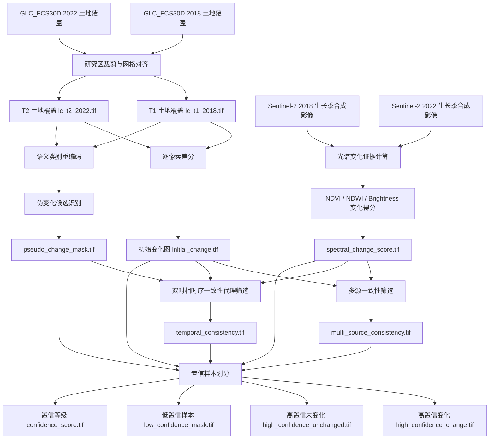

# Weak Label Construction Flow

本文湿地弱监督标签构建流程以 GLC_FCS30D 年度土地覆盖产品和 Sentinel-2 双时相影像为主要输入，先生成初始变化标签，再进行伪变化识别、多源一致性筛选和高低置信样本划分。

## Output Layers

初始弱标签：

- `data/weak_labels/initial_change/<area>/lc_t1_2018.tif`
- `data/weak_labels/initial_change/<area>/lc_t2_2022.tif`
- `data/weak_labels/initial_change/<area>/initial_change.tif`

置信筛选结果：

- `data/weak_labels/confidence/<area>/high_confidence_change.tif`
- `data/weak_labels/confidence/<area>/high_confidence_unchanged.tif`
- `data/weak_labels/confidence/<area>/low_confidence_mask.tif`
- `data/weak_labels/confidence/<area>/confidence_score.tif`

